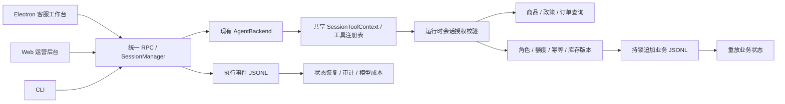

# 需求对照与最小改动说明

范围为需求材料“项目经历”中的**电商场景下的 AI 工作台**。其中实习经历的半导体 RAG、跨知识库检索、敏感值引用和 Skill 安全扫描属于另一项目，未混入本仓库的完成声明。

## 复用与新增

| 项目要求 | 上游已有能力 | MerchantDesk 增量及边界 |
| --- | --- | --- |
| 多模型 API、按任务选择成本 | `packages/shared/src/agent/backend/` 的 AgentBackend、工厂和各模型适配 | 保留会话模型/连接选择；增加按实际模型与连接归因的费用摘要。故障后人工切换，无新增自动无损切换 |
| 类型安全的流式生命周期 | `packages/core/src/types/message.ts` 的 AgentEvent 可辨识联合 | 在 SessionManager 原有处理入口追加投影后的执行日志，包括文本、工具、错误、完成和权限回调 |
| Session/Workspace 隔离、JSONL | 工作区目录、会话消息和 SDK 恢复 | 增加会话授权文件、执行事件 JSONL、业务账本及重放；恢复提示不自动重放变更 |
| IPC/WebSocket 统一传输、多端 | `packages/shared/src/protocol`、`packages/server-core/src/transport` 及客户端适配器 | 沿用协议；在共享工具注册表注册一次，桌面、Web、CLI 共用 |
| SessionToolContext 上下文 | 注入 sessionId、工作区、文件系统、凭据接口 | 处理器只从可信运行时上下文取身份；拒绝模型输入覆盖身份，按角色/订单范围/有效期校验 |
| 商品描述、问答、推荐 | 原有模型会话与工具调用 | 商品事实与政策查询，电商系统提示词、中文入口提示、可复现的虚构商店 |
| 订单查询、退款、库存 | 原有通用工具与权限模式 | 六个 commerce 工具，累计退款额度、幂等、整数金额、跨进程锁、库存版本校验 |
| 客服质量审计与成本归因 | 会话转录、模型 usage | 可导出的执行/失败/权限摘要与模型成本；质量审阅需结合转录，无虚构评分或压测结果 |
| 大促并发会话管理 | 原有消息队列、会话管理、多客户端连接 | 验证并发退款与库存正确性；本地 JSONL 并非分布式交易数据库，未宣称生产流量容量 |

## 执行路径



## 文件结构

```text
workspace/
  config.json                       # 原有工作区配置
  commerce/
    seed.json                       # 不覆盖的虚构商店快照
    grants/<sessionId>.json         # 管理员授权；模型没有授权工具
    ledger.jsonl                    # 退款/库存变更的唯一事实源
    ledger.lock                     # 写事务期间的跨进程锁
  sessions/<sessionId>/
    session.jsonl                   # 原有会话消息和元数据
    commerce-events.jsonl           # 新增的执行事件流
```

同一工作区可共享商品和库存，订单可见范围由每个会话的 grant 决定。工具审计只返回当前会话；管理员可在终端指定会话导出。业务账本只有成功提交的变更；工具失败和拒绝由 AgentEvent 日志记录。

## 改动原则

没有替换原有 AgentBackend、模型 SDK、主 UI 框架或传输协议，也没有新增第二个电商服务端。新增业务代码集中在 `session-tools-core/src/commerce`，SessionManager 仅挂接日志和恢复提醒。保留内部包名及配置约定以减少迁移范围。

公开衍生项目改为 MerchantDesk 名称、帆船图标和独立 bundle ID，关闭默认上游更新/公共分享。Apache 许可、原始版权和商标政策保持。基础 `tsconfig.base.json` 补齐源码包缺失的配置，依赖锁文件按当前工作区重新生成。

所有业务授权均针对受控工具接口。原有本地终端、文件编辑和管理员 RPC 不是恶意租户隔离设施；生产的多商户平台需要独立身份认证和权限服务。详见 SECURITY.md。
